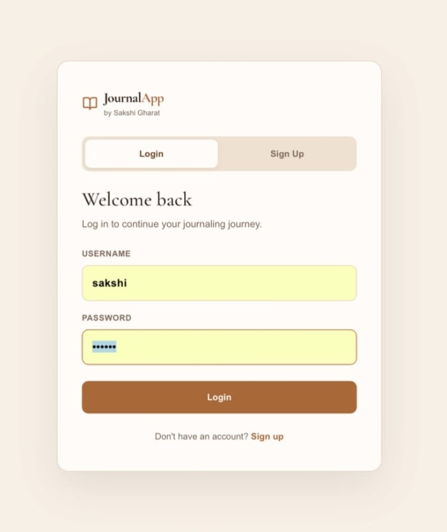
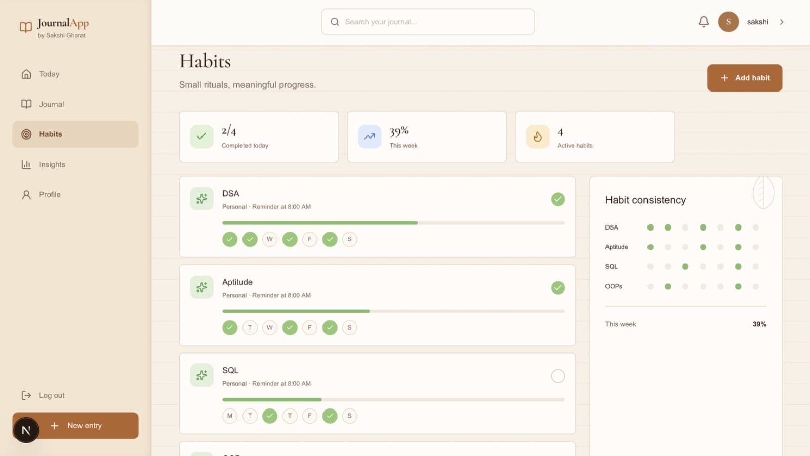
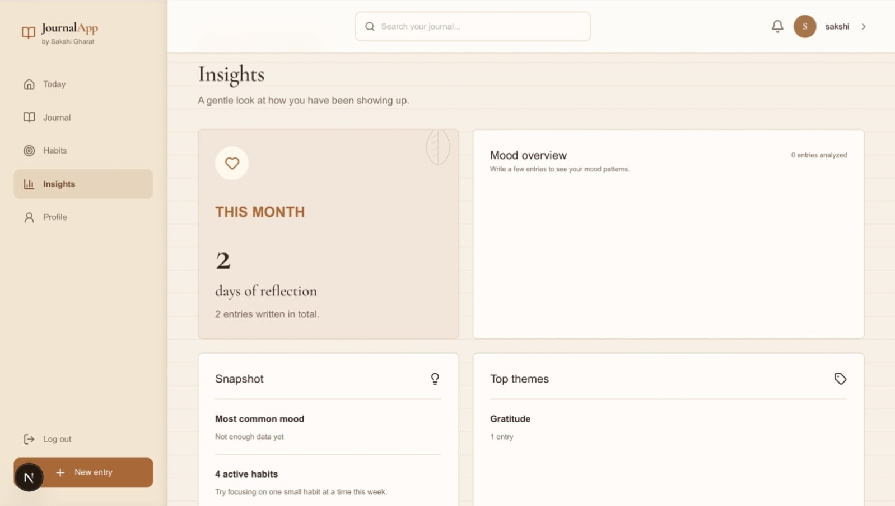
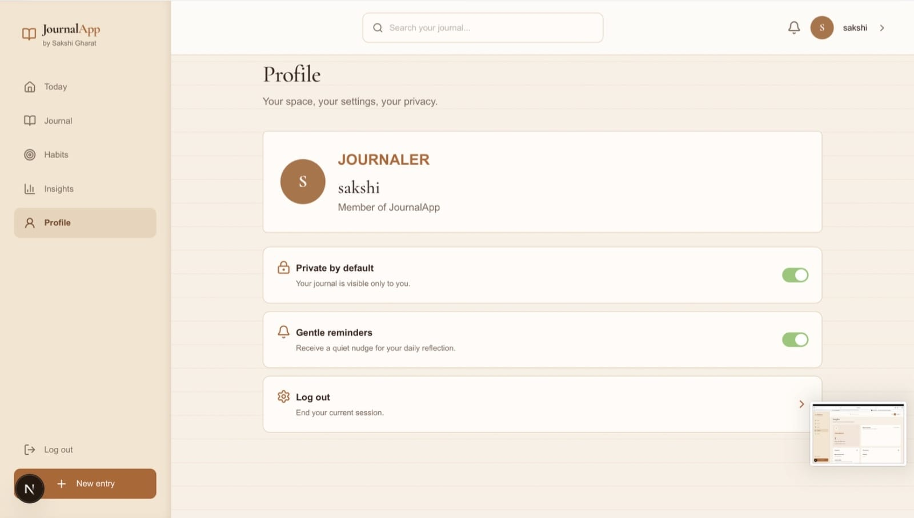
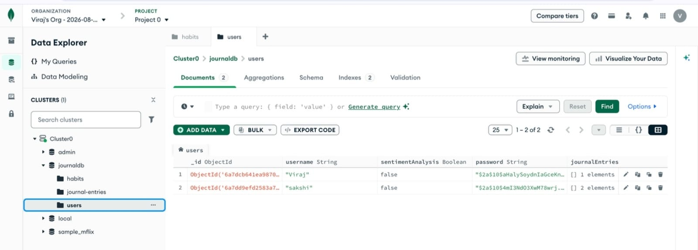
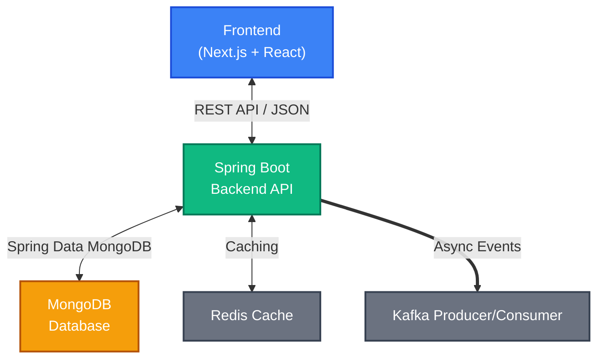

# JournalApp

[](#-tech-stack)
[](#-tech-stack)
[](#-tech-stack)
[](#-tech-stack)
[](#-tech-stack)
[](#-tech-stack)
[](#-tech-stack)
[](#-tech-stack)

> **A full-stack journaling and habit-tracking platform that lets users log daily entries, track personal habits, and stay consistent over time.**

JournalApp pairs a Spring Boot REST API with a Next.js frontend, backed by MongoDB for persistence, Redis for caching, and Kafka for asynchronous event processing — a backend architecture built to handle real-world scale and concurrency rather than a simple CRUD demo.

---

## 📸 Preview

|            Home             |            Login             |
|:---------------------------:|:----------------------------:|
|  |  |

|            Habits             |            Insights            |
|:-----------------------------:|:------------------------------:|
|  |  |

|           Profile            |            Database             |
|:----------------------------:|:-------------------------------:|
|  |  |

---

## ✨ Features

### 📓 Journal Entries
Create, update, and track daily journal entries tied to the authenticated user.

### ✅ Habit Tracking
Log and monitor personal habits over time, linked to the user's journal.

### 🔐 Secure Authentication
JWT-based stateless auth — no server-side session state, token validated on every request via a dedicated filter chain.

### ⚡ Caching Layer
Redis-backed caching at the service layer for fast reads on frequently accessed journal and habit data.

### 📬 Event-Driven Processing
Kafka (via Confluent Cloud) handles asynchronous processing of journal and habit events, decoupling write-side operations from downstream processing.

### 🗄️ Persistent Storage
MongoDB as the primary data store for users, journal entries, and habits.

---

## 🏗️ System Architecture



---

## 🛠️ Tech Stack

| Category | Technologies                          |
| :--- |:--------------------------------------|
| **🎨 Frontend** | 	Next.js 16, React 19, TypeScript, Tailwind CSS 4, shadcn/ui, Lucide Icons                      |
| **⚙️ Backend** | Java 11, Spring Boot, Spring Security |
| **🗄️ Database** | MongoDB                               |
| **⚡ Caching** | Redis                                 |
| **📬 Messaging** | Apache Kafka via Confluent Cloud      |
| **🔐 Authentication** | JWT                                   |
| **🧪 Code Quality** | SonarCloud                            |

---

## 🚀 Getting Started

### Clone the repository
```bash
git clone https://github.com/sakshi048/journalApp.git
cd journalApp
```

### Backend Setup
```bash
cd backend
# configure application.properties / application.yml with:
# - MongoDB connection URI
# - Redis host/port
# - Kafka bootstrap servers & credentials
# - JWT secret key

./mvnw clean install
./mvnw spring-boot:run
```

### Frontend Setup
```bash
cd frontend
npm install
npm run dev
```

### Environment Variables

Backend secrets:
```env
MONGODB_URI=
REDIS_HOST=
REDIS_PORT=
KAFKA_BOOTSTRAP_SERVERS=
KAFKA_API_KEY=
KAFKA_API_SECRET=
JWT_SECRET=
```

---

## 📌 Notable Engineering Highlights

- Fixed a critical Jackson serialization bug affecting journal entry and habit display
- Integrated Redis caching to reduce read latency on frequently accessed journal/habit data
- Integrated Kafka for asynchronous event handling between services
- Enforced code quality standards using SonarCloud quality gates

---

## 🚧 Future Scope

- [ ] Connect Redis cache-first reads to the frontend's API responses
- [ ] Complete Kafka producer/consumer integration end-to-end
- [ ] Deploy frontend to Vercel
- [ ] Add pagination for journal entry history
- [ ] Expand habit-tracking analytics (streaks, weekly summaries)
- [ ] Add unit/integration test coverage

---

## 👤 Author

**Sakshi Gharat**
*Java Backend & Full-Stack Developer*
🎓 Terna Engineering College, University of Mumbai — B.E. Information Technology (AI & ML Honors)

- Portfolio: [sakshi-gharat-portfolio.netlify.app](https://sakshi-gharat-portfolio.netlify.app)
- LinkedIn: [linkedin.com/in/sakshigharat](https://linkedin.com/in/sakshigharat)
- GitHub: [github.com/sakshi048](https://github.com/sakshi048)